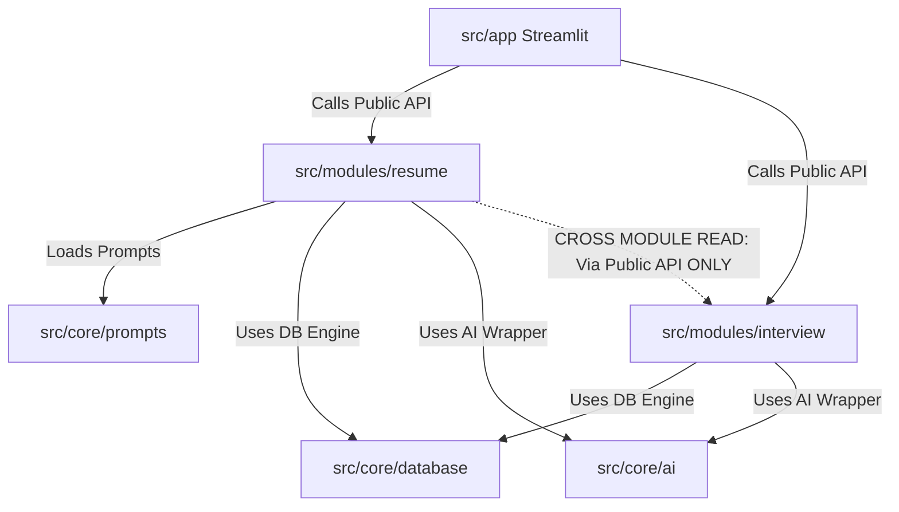

# Folder Structure Design for Career Intelligence System

This document outlines an industry-grade, lightweight, and modular folder structure for a Python 3.12 AI-powered career intelligence system. The design is optimized for a single developer running on a **MacBook Air M5 (16GB RAM)**, maximizing modularity and clean separation of concerns while avoiding the resource-heavy overhead of microservices or containerized enterprise components.

---

## 1. Directory Hierarchy

Below is the proposed layout of the codebase, demonstrating a clean structure that separates frontend UI, feature business logic, shared infrastructure, and configuration.

```text
career_intelligence/
├── .github/                        # CI/CD workflows, issue templates, PR checklists
├── assets/                         # Static assets (logos, images, custom CSS sheets)
├── config/                         # Configuration management (non-secret settings)
│   ├── settings.yaml               # Application rules, LLM model settings, limits
│   └── logging.yaml                # Standard Python logging configuration
├── data/                           # Data storage directory (Git-ignored except structure)
│   ├── career_intelligence.db      # Production/Local SQLite database file
│   └── uploads/                    # User resumes, portfolios, transcript files
├── docs/                           # Architecture decision records (ADRs), module diagrams
├── migrations/                     # SQLite database schema migration scripts (e.g., Alembic)
│   └── versions/                   # Version history of migrations
├── prompts/                        # Centralized Prompt Management (System & User prompts)
│   ├── core/                       # Shared prompt templates (e.g., formatting, safety)
│   ├── resume/                     # Prompts for resume tailors, parser, gap analyzer
│   └── interview/                  # Prompts for mock interview coaching & feedback
├── src/                            # Source code root
│   ├── app/                        # Streamlit Frontend UI
│   │   ├── main.py                 # Streamlit entry point & navigation
│   │   ├── components/             # Reusable UI widgets (cards, file uploaders, alerts)
│   │   └── pages/                  # Streamlit Multi-page dashboards (Feature Views)
│   │       ├── 1_Resume_Tailoring.py
│   │       ├── 2_Interview_Coaching.py
│   │       └── 3_Career_Mapping.py
│   ├── core/                       # Cross-cutting concerns (Shared Infrastructure)
│   │   ├── ai/                     # AI integrations (Clients, Embeddings, Token counters)
│   │   │   ├── __init__.py
│   │   │   ├── client.py           # Base LLM abstraction
│   │   │   ├── providers.py        # Implementations for OpenAI/Anthropic/Ollama
│   │   │   └── embedder.py         # Embedding model interfaces
│   │   ├── database/               # Database management (SQLite, ORM, Connection Pool)
│   │   │   ├── __init__.py
│   │   │   ├── connection.py       # Session lifecycle and engines
│   │   │   └── models.py           # Core shared tables (Users, Subscriptions)
│   │   ├── config.py               # Pydantic Settings settings parser & validator
│   │   ├── exceptions.py           # System-wide custom exception classes
│   │   ├── logging.py              # Central log configuration loader
│   │   └── prompts.py              # Prompt loader (Markdown/Jinja2-based)
│   └── modules/                    # Independent Feature Modules (Vertical Slices)
│       ├── resume/                 # Resume Module
│       │   ├── __init__.py         # Module public interface (API facade)
│       │   ├── models.py           # Resume tables (Resume version history, feedback logs)
│       │   ├── service.py          # Resume core business logic (parsing, mapping)
│       │   └── repository.py       # DB access logic specifically for resume tables
│       ├── interview/              # Interview Module
│       │   ├── __init__.py         # Public interface for interview simulation
│       │   ├── models.py           # Mock session tables
│       │   └── service.py          # Session logic & feedback generator
│       └── career_path/            # Career Mapping Module
│           ├── __init__.py
│           ├── service.py
│           └── external.py         # Third-party job market API integrations (e.g., Adzuna)
├── tests/                          # Test suite mirroring 'src' directory structure
│   ├── conftest.py                 # Shared Pytest fixtures (In-memory SQLite DB)
│   ├── core/                       # Core system unit tests (AI client mock, prompts)
│   ├── modules/                    # Unit tests for individual feature modules
│   └── integration/                # Multi-component flow integration tests
├── .env.example                    # Secret keys template (API keys, DB paths)
├── .gitignore                      # Python/SQLite/Streamlit specific ignore list
├── pyproject.toml                  # Poetry package definition & tool dependencies
├── README.md                       # Project setup & run guide
└── run.sh                          # CLI wrapper script to setup env and launch app
```

---

## 2. Directory Purposes & Separation of Concerns

### `/config` & `/prompts` (Configuration & Prompts)
*   **Purpose**: Separate static business rules, environment configurations, and natural language instructions from execution logic.
*   **Separation of Concerns**: Changes to models (e.g., switching from GPT-4o to Claude 3.5 Sonnet) or prompt structures require adjustments to configuration yaml files/markdown prompt templates rather than modifying Python code files.
*   **Prompt Management**: Utilizing a file-based prompt hierarchy (Jinja2 templates) separates system instructions from backend code, enabling testing of prompts independently.

### `/src/app` (Presentation Layer)
*   **Purpose**: Houses the Streamlit application code.
*   **Separation of Concerns**: The Streamlit pages act *strictly* as a view layer. Pages collect user inputs (files, text inputs), call the appropriate service method from `/src/modules/`, and display results. **No raw database SQL/ORM queries or direct LLM API calls are executed inside UI files.**

### `/src/core` (Cross-cutting Shared Infrastructure)
*   **Purpose**: The operational engine of the system.
*   **Separation of Concerns**: Focuses on infrastructure logic, including database session handling, configuration loading, error management, logging, and third-party API integrations (such as LLMs). It has no awareness of individual career domain logic (e.g. what a resume looks like).

### `/src/modules` (Domain Feature Layer)
*   **Purpose**: Contains vertical feature slices.
*   **Separation of Concerns**: Each subdirectory here represents an independent module. It encapsulates its own models (database tables specific to the feature), repositories (database queries), and services (business logic).

### `/tests` (Testing Layer)
*   **Purpose**: Houses tests in a structure mirroring `src/`.
*   **Separation of Concerns**: Keeps tests close to target modules but outside runtime packages, streamlining builds and production bundle generation.

---

## 3. Module Boundaries & Communication Rules

To maintain high modularity for a single developer, strict boundaries are enforced between feature modules:



### Module Boundary Rules:
1.  **Public API Exposure (`__init__.py`)**:
    A module must expose its public functions, classes, and services through its root `__init__.py`. Streamlit UI and other modules *must only* import from this file.
    *   *Good*: `from src.modules.resume import analyze_resume`
    *   *Bad*: `from src.modules.resume.service import _parse_pdf_to_text`
2.  **No Circular Dependencies**:
    Feature modules must not have bidirectional dependencies. If `interview` requires resume data, it should request it via a clean service argument, or read through a one-way path via the public API of the `resume` module.
3.  **Strict Isolation of Database Tables**:
    Feature-specific SQL/ORM models should belong directly inside the feature module (e.g., `src/modules/resume/models.py`). Core shared models (like user account credentials, payment states) reside inside `src/core/database/models.py`.

---

## 4. Naming Conventions

Consistency speeds up development for a single developer. The following naming rules are strictly enforced:

| Entity | Case Convention | Example | Notes |
| :--- | :--- | :--- | :--- |
| **Directories** | `snake_case` | `resume_optimizer` | Plural only for root grouping folders (e.g., `modules`, `tests`). |
| **Python Files** | `snake_case` | `connection.py` | Must be descriptive. Avoid generic names like `helper.py`. |
| **Streamlit Pages** | `snake_case` or `Number_Name.py` | `1_Resume_Tailoring.py` | Streamlit uses numbers for sorting views automatically in the sidebar. |
| **Classes** | `PascalCase` | `LLMClient` | Applies to Service, Repository, Database models, and exceptions. |
| **Functions & Variables** | `snake_case` | `get_db_session` | Prefix actions with verbs (`get_`, `parse_`, `create_`). |
| **Constants** | `UPPER_SNAKE` | `DEFAULT_MAX_TOKENS` | Global module configuration levels or standard defaults. |

---

## 5. M5 MacBook Air 16GB RAM Optimization Guidelines

This structure is highly optimized for local development and execution on unified memory architectures:

1.  **LiteLLM/Mocking Abstraction**:
    The client wrapper in `/src/core/ai/` allows easy swapping between premium cloud APIs (e.g., Anthropic, OpenAI) and local running LLMs (e.g., Ollama running Llama-3-8B using local GPU acceleration on the Apple Silicon M5 chip) without modifying any application code.
2.  **SQLite in WAL Mode**:
    SQLite is chosen instead of Postgres/Docker dependencies. The core database module leverages **Write-Ahead Logging (WAL)** mode for fast read/write speeds, using zero background service memory when the system is inactive.
3.  **Memory-Efficient File Handlers**:
    PDF or docx parsing modules process files using generators or chunked loading in stream-mode rather than fully loading raw buffers into RAM.
